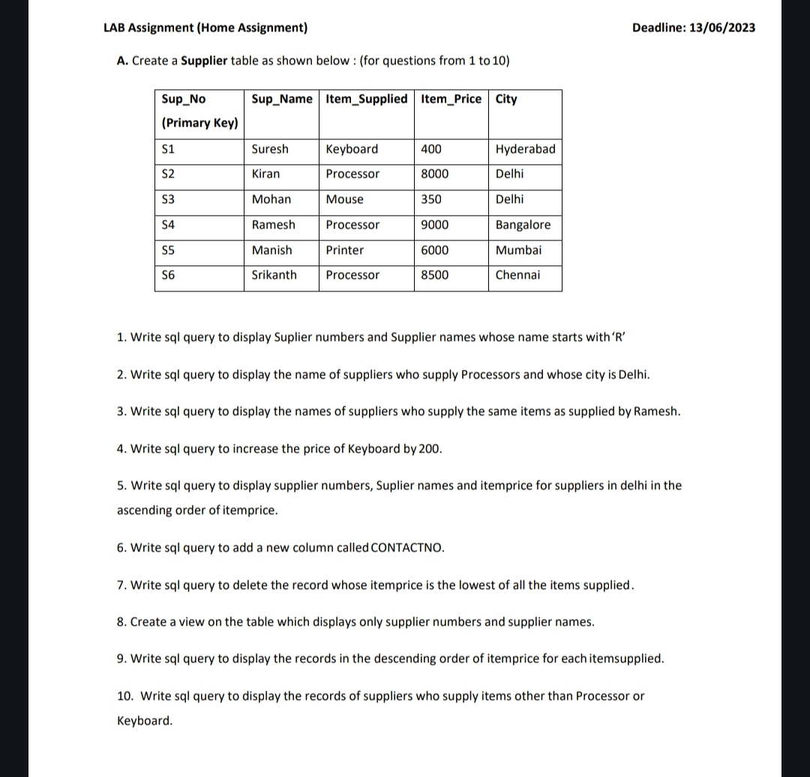

# A. create supplier table as shown below (for question 1 - 10)

## 1. Table Creation and Data Insertion

```sql
CREATE TABLE Supplier (
    Sup_No VARCHAR2(10) PRIMARY KEY,
    Sup_Name VARCHAR2(50),
    Item_Supplied VARCHAR2(50),
    Item_Price NUMBER,
    City VARCHAR2(50)
);

INSERT ALL
    INTO Supplier (Sup_No, Sup_Name, Item_Supplied, Item_Price, City) VALUES ('S1', 'Suresh', 'Keyboard', 400, 'Hyderabad')
    INTO Supplier (Sup_No, Sup_Name, Item_Supplied, Item_Price, City) VALUES ('S2', 'Kiran', 'Processor', 8000, 'Delhi')
    INTO Supplier (Sup_No, Sup_Name, Item_Supplied, Item_Price, City) VALUES ('S3', 'Mohan', 'Mouse', 350, 'Delhi')
    INTO Supplier (Sup_No, Sup_Name, Item_Supplied, Item_Price, City) VALUES ('S4', 'Ramesh', 'Processor', 9000, 'Bangalore')
    INTO Supplier (Sup_No, Sup_Name, Item_Supplied, Item_Price, City) VALUES ('S5', 'Manish', 'Printer', 6000, 'Mumbai')
    INTO Supplier (Sup_No, Sup_Name, Item_Supplied, Item_Price, City) VALUES ('S6', 'Srikanth', 'Processor', 8500, 'Chennai')
SELECT * FROM dual;
```
<table border="1" cellpadding="10" cellspacing="0">
    <thead>
        <tr>
            <th>Sup_No</th>
            <th>Sup_Name</th>
            <th>Item_Supplied</th>
            <th>Item_Price</th>
            <th>City</th>
        </tr>
    </thead>
    <tbody>
        <tr>
            <td>S1</td>
            <td>Suresh</td>
            <td>Keyboard</td>
            <td>400</td>
            <td>Hyderabad</td>
        </tr>
        <tr>
            <td>S2</td>
            <td>Kiran</td>
            <td>Processor</td>
            <td>8000</td>
            <td>Delhi</td>
        </tr>
        <tr>
            <td>S3</td>
            <td>Mohan</td>
            <td>Mouse</td>
            <td>350</td>
            <td>Delhi</td>
        </tr>
        <tr>
            <td>S4</td>
            <td>Ramesh</td>
            <td>Processor</td>
            <td>9000</td>
            <td>Bangalore</td>
        </tr>
        <tr>
            <td>S5</td>
            <td>Manish</td>
            <td>Printer</td>
            <td>6000</td>
            <td>Mumbai</td>
        </tr>
        <tr>
            <td>S6</td>
            <td>Srikanth</td>
            <td>Processor</td>
            <td>8500</td>
            <td>Chennai</td>
        </tr>
    </tbody>
</table>


## 2. Queries

### Query 1: Display supplier numbers and names whose name starts with 'R'
```sql
SELECT Sup_No, Sup_Name 
FROM Supplier 
WHERE Sup_Name LIKE 'R%';
```
<table border="1" cellpadding="10" cellspacing="0">
    <thead>
        <tr>
            <th>Sup_No</th>
            <th>Sup_Name</th>
        </tr>
    </thead>
    <tbody>
        <tr>
            <td>S4</td>
            <td>Ramesh</td>
        </tr>
    </tbody>
</table>


### Query 2: Display names of suppliers who supply Processors and whose city is Delhi
```sql
SELECT Sup_Name 
FROM Supplier 
WHERE Item_Supplied = 'Processor' AND City = 'Delhi';
```
<table border="1" cellpadding="10" cellspacing="0">
    <thead>
        <tr>
            <th>Sup_Name</th>
        </tr>
    </thead>
    <tbody>
        <tr>
            <td>Kiran</td>
        </tr>
    </tbody>
</table>


### Query 3: Display names of suppliers who supply the same items as Ramesh
```sql
SELECT Sup_Name 
FROM Supplier 
WHERE Item_Supplied = (SELECT Item_Supplied FROM Supplier WHERE Sup_Name = 'Ramesh');
```
<table border="1" cellpadding="10" cellspacing="0">
    <thead>
        <tr>
            <th>Sup_Name</th>
        </tr>
    </thead>
    <tbody>
        <tr>
            <td>Ramesh</td>
        </tr>
        <tr>
            <td>Kiran</td>
        </tr>
        <tr>
            <td>Srikanth</td>
        </tr>
    </tbody>
</table>


### Query 4: Increase the price of Keyboard by 200
```sql
UPDATE Supplier 
SET Item_Price = Item_Price + 200 
WHERE Item_Supplied = 'Keyboard';
```
<table border="1" cellpadding="10" cellspacing="0">
    <thead>
        <tr>
            <th>Sup_No</th>
            <th>Sup_Name</th>
            <th>Item_Supplied</th>
            <th>Item_Price</th>
            <th>City</th>
        </tr>
    </thead>
    <tbody>
        <tr>
            <td>S1</td>
            <td>Suresh</td>
            <td>Keyboard</td>
            <td>600</td>
            <td>Hyderabad</td>
        </tr>
    </tbody>
</table>


### Query 5: Display supplier numbers, names, and item prices for suppliers in Delhi in ascending order of item price
```sql
SELECT Sup_No, Sup_Name, Item_Price 
FROM Supplier 
WHERE City = 'Delhi' 
ORDER BY Item_Price ASC;
```
<table border="1" cellpadding="10" cellspacing="0">
    <thead>
        <tr>
            <th>Sup_No</th>
            <th>Sup_Name</th>
            <th>Item_Price</th>
        </tr>
    </thead>
    <tbody>
        <tr>
            <td>S3</td>
            <td>Mohan</td>
            <td>350</td>
        </tr>
        <tr>
            <td>S2</td>
            <td>Kiran</td>
            <td>8000</td>
        </tr>
    </tbody>
</table>


### Query 6: Add a new column called CONTACTNO
```sql
ALTER TABLE Supplier 
ADD CONTACTNO VARCHAR2(15);
```
<table border="1" cellpadding="10" cellspacing="0">
    <thead>
        <tr>
            <th>Sup_No</th>
            <th>Sup_Name</th>
            <th>Item_Supplied</th>
            <th>Item_Price</th>
            <th>City</th>
            <th>CONTACTNO</th>
        </tr>
    </thead>
    <tbody>
        <tr>
            <td>S1</td>
            <td>Suresh</td>
            <td>Keyboard</td>
            <td>600</td>
            <td>Hyderabad</td>
            <td></td>
        </tr>
        <tr>
            <td>S2</td>
            <td>Kiran</td>
            <td>Processor</td>
            <td>8000</td>
            <td>Delhi</td>
            <td></td>
        </tr>
        <tr>
            <td>S3</td>
            <td>Mohan</td>
            <td>Mouse</td>
            <td>350</td>
            <td>Delhi</td>
            <td></td>
        </tr>
        <tr>
            <td>S4</td>
            <td>Ramesh</td>
            <td>Processor</td>
            <td>9000</td>
            <td>Bangalore</td>
            <td></td>
        </tr>
        <tr>
            <td>S5</td>
            <td>Manish</td>
            <td>Printer</td>
            <td>6000</td>
            <td>Mumbai</td>
            <td></td>
        </tr>
        <tr>
            <td>S6</td>
            <td>Srikanth</td>
            <td>Processor</td>
            <td>8500</td>
            <td>Chennai</td>
            <td></td>
        </tr>
    </tbody>
</table>


### Query 7: Delete the record whose item price is the lowest among all items supplied
```sql
DELETE FROM Supplier 
WHERE Item_Price = (SELECT MIN(Item_Price) FROM Supplier);
```
<table border="1" cellpadding="10" cellspacing="0">
    <thead>
        <tr>
            <th>Sup_No</th>
            <th>Sup_Name</th>
            <th>Item_Supplied</th>
            <th>Item_Price</th>
            <th>City</th>
            <th>CONTACTNO</th>
        </tr>
    </thead>
    <tbody>
        <tr>
            <td>S2</td>
            <td>Kiran</td>
            <td>Processor</td>
            <td>8000</td>
            <td>Delhi</td>
            <td></td>
        </tr>
        <tr>
            <td>S3</td>
            <td>Mohan</td>
            <td>Mouse</td>
            <td>350</td>
            <td>Delhi</td>
            <td></td>
        </tr>
        <tr>
            <td>S4</td>
            <td>Ramesh</td>
            <td>Processor</td>
            <td>9000</td>
            <td>Bangalore</td>
            <td></td>
        </tr>
        <tr>
            <td>S5</td>
            <td>Manish</td>
            <td>Printer</td>
            <td>6000</td>
            <td>Mumbai</td>
            <td></td>
        </tr>
        <tr>
            <td>S6</td>
            <td>Srikanth</td>
            <td>Processor</td>
            <td>8500</td>
            <td>Chennai</td>
            <td></td>
        </tr>
    </tbody>
</table>


### Query 8: Create a view to display only supplier numbers and names
```sql
CREATE VIEW Supplier_View AS 
SELECT Sup_No, Sup_Name 
FROM Supplier;
```
<table border="1" cellpadding="10" cellspacing="0">
    <thead>
        <tr>
            <th>Sup_No</th>
            <th>Sup_Name</th>
        </tr>
    </thead>
    <tbody>
        <tr>
            <td>S1</td>
            <td>Suresh</td>
        </tr>
        <tr>
            <td>S2</td>
            <td>Kiran</td>
        </tr>
        <tr>
            <td>S3</td>
            <td>Mohan</td>
        </tr>
        <tr>
            <td>S4</td>
            <td>Ramesh</td>
        </tr>
        <tr>
            <td>S5</td>
            <td>Manish</td>
        </tr>
        <tr>
            <td>S6</td>
            <td>Srikanth</td>
        </tr>
    </tbody>
</table>


### Query 9: Display records in descending order of item price for each item supplied
```sql
SELECT * 
FROM Supplier 
ORDER BY Item_Supplied, Item_Price DESC;
```
<table border="1" cellpadding="10" cellspacing="0">
    <thead>
        <tr>
            <th>Sup_No</th>
            <th>Sup_Name</th>
            <th>Item_Supplied</th>
            <th>Item_Price</th>
            <th>City</th>
            <th>CONTACTNO</th>
        </tr>
    </thead>
    <tbody>
        <tr>
            <td>S4</td>
            <td>Ramesh</td>
            <td>Processor</td>
            <td>9000</td>
            <td>Bangalore</td>
            <td></td>
        </tr>
        <tr>
            <td>S6</td>
            <td>Srikanth</td>
            <td>Processor</td>
            <td>8500</td>
            <td>Chennai</td>
            <td></td>
        </tr>
        <tr>
            <td>S2</td>
            <td>Kiran</td>
            <td>Processor</td>
            <td>8000</td>
            <td>Delhi</td>
            <td></td>
        </tr>
        <tr>
            <td>S5</td>
            <td>Manish</td>
            <td>Printer</td>
            <td>6000</td>
            <td>Mumbai</td>
            <td></td>
        </tr>
        <tr>
            <td>S1</td>
            <td>Suresh</td>
            <td>Keyboard</td>
            <td>600</td>
            <td>Hyderabad</td>
            <td></td>
        </tr>
        <tr>
            <td>S3</td>
            <td>Mohan</td>
            <td>Mouse</td>
            <td>350</td>
            <td>Delhi</td>
            <td></td>
        </tr>
    </tbody>
</table>


### Query 10: Display records of suppliers who supply items other than Processor or Keyboard
```sql
SELECT * 
FROM Supplier 
WHERE Item_Supplied NOT IN ('Processor', 'Keyboard');
```
<table border="1" cellpadding="10" cellspacing="0">
    <thead>
        <tr>
            <th>Sup_No</th>
            <th>Sup_Name</th>
            <th>Item_Supplied</th>
            <th>Item_Price</th>
            <th>City</th>
            <th>CONTACTNO</th>
        </tr>
    </thead>
    <tbody>
        <tr>
            <td>S5</td>
            <td>Manish</td>
            <td>Printer</td>
            <td>6000</td>
            <td>Mumbai</td>
            <td></td>
        </tr>
    </tbody>
</table>

