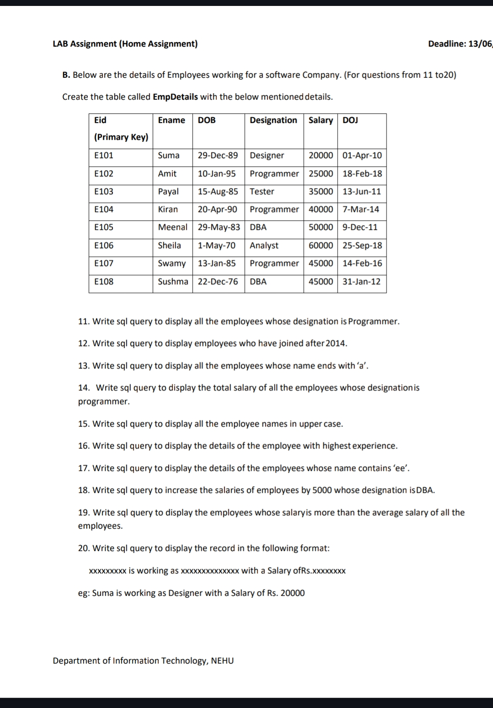

# B. Below are the details of employees working for the software company ( for questions 11 - 20 )


## Table Creation

```sql
CREATE TABLE EmpDetails (
    Eid VARCHAR2(10) PRIMARY KEY,
    Ename VARCHAR2(50),
    DOB DATE,
    Designation VARCHAR2(30),
    Salary NUMBER,
    DOJ DATE
);
```

## Insert Data

```sql
INSERT ALL
  INTO EmpDetails VALUES ('E101', 'Suma', TO_DATE('29-Dec-89', 'DD-Mon-YY'), 'Designer', 20000, TO_DATE('01-Apr-10', 'DD-Mon-YY'))
  INTO EmpDetails VALUES ('E102', 'Amit', TO_DATE('10-Jan-95', 'DD-Mon-YY'), 'Programmer', 25000, TO_DATE('18-Feb-18', 'DD-Mon-YY'))
  INTO EmpDetails VALUES ('E103', 'Payal', TO_DATE('15-Aug-85', 'DD-Mon-YY'), 'Tester', 35000, TO_DATE('13-Jun-11', 'DD-Mon-YY'))
  INTO EmpDetails VALUES ('E104', 'Kiran', TO_DATE('20-Apr-90', 'DD-Mon-YY'), 'Programmer', 40000, TO_DATE('07-Mar-14', 'DD-Mon-YY'))
  INTO EmpDetails VALUES ('E105', 'Meenal', TO_DATE('29-May-83', 'DD-Mon-YY'), 'DBA', 50000, TO_DATE('09-Dec-11', 'DD-Mon-YY'))
  INTO EmpDetails VALUES ('E106', 'Sheila', TO_DATE('01-May-70', 'DD-Mon-YY'), 'Analyst', 60000, TO_DATE('25-Sep-18', 'DD-Mon-YY'))
  INTO EmpDetails VALUES ('E107', 'Swamy', TO_DATE('13-Jan-85', 'DD-Mon-YY'), 'Programmer', 45000, TO_DATE('14-Feb-16', 'DD-Mon-YY'))
  INTO EmpDetails VALUES ('E108', 'Sushma', TO_DATE('22-Dec-76', 'DD-Mon-YY'), 'DBA', 45000, TO_DATE('31-Jan-12', 'DD-Mon-YY'))
SELECT * FROM dual;

```

## Queries


# SQL Queries for Employee Data

## 11. Employees whose designation is Programmer
```sql
SELECT * FROM EmpDetails WHERE Designation = 'Programmer';
```

## 12. Employees who joined after 2014
```sql
SELECT * FROM EmpDetails WHERE DOJ > TO_DATE('31-Dec-2014', 'DD-Mon-YYYY');
```

## 13. Employees whose name ends with 'a'
```sql
SELECT * FROM EmpDetails WHERE Ename LIKE '%a';
```

## 14. Total salary of Programmers
```sql
SELECT SUM(Salary) FROM EmpDetails WHERE Designation = 'Programmer';
```

## 15. All employee names in upper case
```sql
SELECT UPPER(Ename) FROM EmpDetails;
```

## 16. Employee with highest experience (earliest DOJ)
```sql
SELECT * FROM EmpDetails WHERE DOJ = (SELECT MIN(DOJ) FROM EmpDetails);
```

## 17. Employees whose name contains 'ee'
```sql
SELECT * FROM EmpDetails WHERE Ename LIKE '%ee%';
```

## 18. Increase salary by 5000 for DBAs
```sql
UPDATE EmpDetails SET Salary = Salary + 5000 WHERE Designation = 'DBA';
```

## 19. Employees earning more than average salary
```sql
SELECT * FROM EmpDetails WHERE Salary > (SELECT AVG(Salary) FROM EmpDetails);
```

## 20. Custom display of employee records
```sql
SELECT Ename || ' is working as ' || Designation || ' with a Salary of Rs. ' || Salary AS Employee_Info FROM EmpDetails;
```
