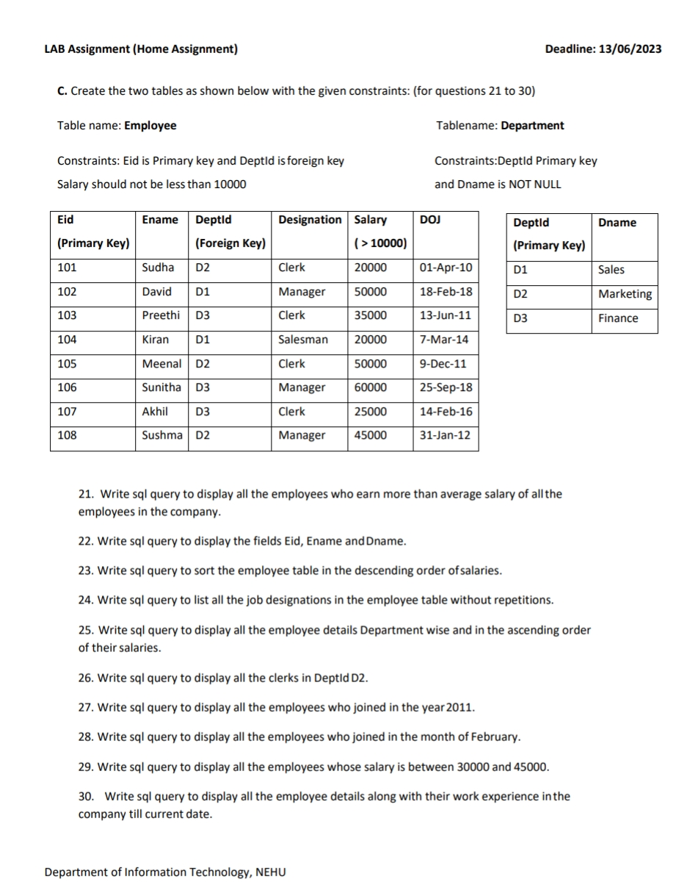

# Create the tables as shown below with the given constrainsts ( for question 21 - 30 )


## Create Tables

```sql
CREATE TABLE Department (
    DeptId VARCHAR2(2) PRIMARY KEY,
    Dname VARCHAR2(20) NOT NULL
);

CREATE TABLE Employee (
    Eid NUMBER PRIMARY KEY,
    Ename VARCHAR2(20),
    DeptId VARCHAR2(2),
    Designation VARCHAR2(20),
    Salary NUMBER CHECK (Salary > 10000),
    DOJ DATE,
    FOREIGN KEY (DeptId) REFERENCES Department(DeptId)
);
```

## Insert Values

```sql
-- Insert into Department using INSERT ALL
INSERT ALL
    INTO Department (DeptId, Dname) VALUES ('D1', 'Sales')
    INTO Department (DeptId, Dname) VALUES ('D2', 'Marketing')
    INTO Department (DeptId, Dname) VALUES ('D3', 'Finance')
SELECT * FROM dual;

-- Insert into Employee using INSERT ALL
INSERT ALL
    INTO Employee VALUES (101, 'Sudha', 'D2', 'Clerk', 20000, TO_DATE('01-Apr-2010', 'DD-Mon-YYYY'))
    INTO Employee VALUES (102, 'David', 'D1', 'Manager', 50000, TO_DATE('18-Feb-2018', 'DD-Mon-YYYY'))
    INTO Employee VALUES (103, 'Preethi', 'D3', 'Clerk', 35000, TO_DATE('13-Jun-2011', 'DD-Mon-YYYY'))
    INTO Employee VALUES (104, 'Kiran', 'D1', 'Salesman', 20000, TO_DATE('07-Mar-2014', 'DD-Mon-YYYY'))
    INTO Employee VALUES (105, 'Meenal', 'D2', 'Clerk', 50000, TO_DATE('09-Dec-2011', 'DD-Mon-YYYY'))
    INTO Employee VALUES (106, 'Sunitha', 'D3', 'Manager', 60000, TO_DATE('25-Sep-2018', 'DD-Mon-YYYY'))
    INTO Employee VALUES (107, 'Akhil', 'D3', 'Clerk', 25000, TO_DATE('14-Feb-2016', 'DD-Mon-YYYY'))
    INTO Employee VALUES (108, 'Sushma', 'D2', 'Manager', 45000, TO_DATE('31-Jan-2012', 'DD-Mon-YYYY'))
SELECT * FROM dual;
```
<h>Department</h>
<table border="1" cellpadding="10" cellspacing="0">
    <thead>
        <tr>
            <th>DeptId</th>
            <th>Dname</th>
        </tr>
    </thead>
    <tbody>
        <tr>
            <td>D1</td>
            <td>Sales</td>
        </tr>
        <tr>
            <td>D2</td>
            <td>Marketing</td>
        </tr>
        <tr>
            <td>D3</td>
            <td>Finance</td>
        </tr>
    </tbody>
</table>

<h>Employee</h>
<table border="1" cellpadding="10" cellspacing="0">
    <thead>
        <tr>
            <th>EmpId</th>
            <th>EmpName</th>
            <th>DeptId</th>
            <th>Job</th>
            <th>Salary</th>
            <th>DOJ</th>
        </tr>
    </thead>
    <tbody>
        <tr>
            <td>101</td>
            <td>Sudha</td>
            <td>D2</td>
            <td>Clerk</td>
            <td>20000</td>
            <td>01-Apr-2010</td>
        </tr>
        <tr>
            <td>102</td>
            <td>David</td>
            <td>D1</td>
            <td>Manager</td>
            <td>50000</td>
            <td>18-Feb-2018</td>
        </tr>
        <tr>
            <td>103</td>
            <td>Preethi</td>
            <td>D3</td>
            <td>Clerk</td>
            <td>35000</td>
            <td>13-Jun-2011</td>
        </tr>
        <tr>
            <td>104</td>
            <td>Kiran</td>
            <td>D1</td>
            <td>Salesman</td>
            <td>20000</td>
            <td>07-Mar-2014</td>
        </tr>
        <tr>
            <td>105</td>
            <td>Meenal</td>
            <td>D2</td>
            <td>Clerk</td>
            <td>50000</td>
            <td>09-Dec-2011</td>
        </tr>
        <tr>
            <td>106</td>
            <td>Sunitha</td>
            <td>D3</td>
            <td>Manager</td>
            <td>60000</td>
            <td>25-Sep-2018</td>
        </tr>
        <tr>
            <td>107</td>
            <td>Akhil</td>
            <td>D3</td>
            <td>Clerk</td>
            <td>25000</td>
            <td>14-Feb-2016</td>
        </tr>
        <tr>
            <td>108</td>
            <td>Sushma</td>
            <td>D2</td>
            <td>Manager</td>
            <td>45000</td>
            <td>31-Jan-2012</td>
        </tr>
    </tbody>
</table>


---

## Query Solutions

### 21. Employees earning more than average salary

```sql
SELECT * FROM Employee
WHERE Salary > (SELECT AVG(Salary) FROM Employee);
```
<table border="1" cellpadding="10" cellspacing="0">
    <thead>
        <tr>
            <th>EmpId</th>
            <th>EmpName</th>
            <th>DeptId</th>
            <th>Job</th>
            <th>Salary</th>
            <th>DOJ</th>
        </tr>
    </thead>
    <tbody>
        <tr>
            <td>102</td>
            <td>David</td>
            <td>D1</td>
            <td>Manager</td>
            <td>50000</td>
            <td>18-Feb-2018</td>
        </tr>
        <tr>
            <td>106</td>
            <td>Sunitha</td>
            <td>D3</td>
            <td>Manager</td>
            <td>60000</td>
            <td>25-Sep-2018</td>
        </tr>
    </tbody>
</table>


### 22. Display Eid, Ename, and Dname

```sql
SELECT E.Eid, E.Ename, D.Dname
FROM Employee E
JOIN Department D ON E.DeptId = D.DeptId;
```
<table border="1" cellpadding="10" cellspacing="0">
    <thead>
        <tr>
            <th>EmpId</th>
            <th>EmpName</th>
            <th>DeptName</th>
        </tr>
    </thead>
    <tbody>
        <tr>
            <td>101</td>
            <td>Sudha</td>
            <td>Sales</td>
        </tr>
        <tr>
            <td>102</td>
            <td>David</td>
            <td>Sales</td>
        </tr>
        <tr>
            <td>103</td>
            <td>Preethi</td>
            <td>Finance</td>
        </tr>
        <tr>
            <td>104</td>
            <td>Kiran</td>
            <td>Sales</td>
        </tr>
        <tr>
            <td>105</td>
            <td>Meenal</td>
            <td>Marketing</td>
        </tr>
        <tr>
            <td>106</td>
            <td>Sunitha</td>
            <td>Finance</td>
        </tr>
        <tr>
            <td>107</td>
            <td>Akhil</td>
            <td>Finance</td>
        </tr>
        <tr>
            <td>108</td>
            <td>Sushma</td>
            <td>Marketing</td>
        </tr>
    </tbody>
</table>


### 23. Sort employees by salary (descending)

```sql
SELECT * FROM Employee
ORDER BY Salary DESC;
```
<table border="1" cellpadding="10" cellspacing="0">
    <thead>
        <tr>
            <th>EmpId</th>
            <th>EmpName</th>
            <th>DeptId</th>
            <th>Job</th>
            <th>Salary</th>
            <th>DOJ</th>
        </tr>
    </thead>
    <tbody>
        <tr>
            <td>106</td>
            <td>Sunitha</td>
            <td>D3</td>
            <td>Manager</td>
            <td>60000</td>
            <td>25-Sep-2018</td>
        </tr>
        <tr>
            <td>102</td>
            <td>David</td>
            <td>D1</td>
            <td>Manager</td>
            <td>50000</td>
            <td>18-Feb-2018</td>
        </tr>
        <tr>
            <td>105</td>
            <td>Meenal</td>
            <td>D2</td>
            <td>Clerk</td>
            <td>50000</td>
            <td>09-Dec-2011</td>
        </tr>
        <tr>
            <td>108</td>
            <td>Sushma</td>
            <td>D2</td>
            <td>Manager</td>
            <td>45000</td>
            <td>31-Jan-2012</td>
        </tr>
        <tr>
            <td>103</td>
            <td>Preethi</td>
            <td>D3</td>
            <td>Clerk</td>
            <td>35000</td>
            <td>13-Jun-2011</td>
        </tr>
        <tr>
            <td>107</td>
            <td>Akhil</td>
            <td>D3</td>
            <td>Clerk</td>
            <td>25000</td>
            <td>14-Feb-2016</td>
        </tr>
        <tr>
            <td>104</td>
            <td>Kiran</td>
            <td>D1</td>
            <td>Salesman</td>
            <td>20000</td>
            <td>07-Mar-2014</td>
        </tr>
        <tr>
            <td>101</td>
            <td>Sudha</td>
            <td>D2</td>
            <td>Clerk</td>
            <td>20000</td>
            <td>01-Apr-2010</td>
        </tr>
    </tbody>
</table>


### 24. List all job designations without repetitions

```sql
SELECT DISTINCT Designation FROM Employee;
```
<table border="1" cellpadding="10" cellspacing="0">
    <thead>
        <tr>
            <th>Designation</th>
        </tr>
    </thead>
    <tbody>
        <tr>
            <td>Clerk</td>
        </tr>
        <tr>
            <td>Manager</td>
        </tr>
        <tr>
            <td>Salesman</td>
        </tr>
    </tbody>
</table>


### 25. Employee details department-wise and ascending by salary

```sql
SELECT * FROM Employee
ORDER BY DeptId, Salary ASC;
```
<table border="1" cellpadding="10" cellspacing="0">
    <thead>
        <tr>
            <th>EmpId</th>
            <th>EmpName</th>
            <th>DeptId</th>
            <th>Job</th>
            <th>Salary</th>
            <th>DOJ</th>
        </tr>
    </thead>
    <tbody>
        <tr>
            <td>101</td>
            <td>Sudha</td>
            <td>D2</td>
            <td>Clerk</td>
            <td>20000</td>
            <td>01-Apr-2010</td>
        </tr>
        <tr>
            <td>104</td>
            <td>Kiran</td>
            <td>D1</td>
            <td>Salesman</td>
            <td>20000</td>
            <td>07-Mar-2014</td>
        </tr>
        <tr>
            <td>108</td>
            <td>Sushma</td>
            <td>D2</td>
            <td>Manager</td>
            <td>45000</td>
            <td>31-Jan-2012</td>
        </tr>
        <tr>
            <td>102</td>
            <td>David</td>
            <td>D1</td>
            <td>Manager</td>
            <td>50000</td>
            <td>18-Feb-2018</td>
        </tr>
        <tr>
            <td>105</td>
            <td>Meenal</td>
            <td>D2</td>
            <td>Clerk</td>
            <td>50000</td>
            <td>09-Dec-2011</td>
        </tr>
        <tr>
            <td>103</td>
            <td>Preethi</td>
            <td>D3</td>
            <td>Clerk</td>
            <td>35000</td>
            <td>13-Jun-2011</td>
        </tr>
        <tr>
            <td>107</td>
            <td>Akhil</td>
            <td>D3</td>
            <td>Clerk</td>
            <td>25000</td>
            <td>14-Feb-2016</td>
        </tr>
        <tr>
            <td>106</td>
            <td>Sunitha</td>
            <td>D3</td>
            <td>Manager</td>
            <td>60000</td>
            <td>25-Sep-2018</td>
        </tr>
    </tbody>
</table>


### 26. Display all clerks in DeptId D2

```sql
SELECT * FROM Employee
WHERE Designation = 'Clerk' AND DeptId = 'D2';
```
<table border="1" cellpadding="10" cellspacing="0">
    <thead>
        <tr>
            <th>EmpId</th>
            <th>EmpName</th>
            <th>DeptId</th>
            <th>Job</th>
            <th>Salary</th>
            <th>DOJ</th>
        </tr>
    </thead>
    <tbody>
        <tr>
            <td>101</td>
            <td>Sudha</td>
            <td>D2</td>
            <td>Clerk</td>
            <td>20000</td>
            <td>01-Apr-2010</td>
        </tr>
        <tr>
            <td>105</td>
            <td>Meenal</td>
            <td>D2</td>
            <td>Clerk</td>
            <td>50000</td>
            <td>09-Dec-2011</td>
        </tr>
    </tbody>
</table>


### 27. Employees who joined in 2011

```sql
SELECT * FROM Employee
WHERE EXTRACT(YEAR FROM DOJ) = 2011;
```
<table border="1" cellpadding="10" cellspacing="0">
    <thead>
        <tr>
            <th>EmpId</th>
            <th>EmpName</th>
            <th>DeptId</th>
            <th>Job</th>
            <th>Salary</th>
            <th>DOJ</th>
        </tr>
    </thead>
    <tbody>
        <tr>
            <td>103</td>
            <td>Preethi</td>
            <td>D3</td>
            <td>Clerk</td>
            <td>35000</td>
            <td>13-Jun-2011</td>
        </tr>
        <tr>
            <td>105</td>
            <td>Meenal</td>
            <td>D2</td>
            <td>Clerk</td>
            <td>50000</td>
            <td>09-Dec-2011</td>
        </tr>
    </tbody>
</table>


### 28. Employees who joined in February

```sql
SELECT * FROM Employee
WHERE EXTRACT(MONTH FROM DOJ) = 2;
```
<table border="1" cellpadding="10" cellspacing="0">
    <thead>
        <tr>
            <th>EmpId</th>
            <th>EmpName</th>
            <th>DeptId</th>
            <th>Job</th>
            <th>Salary</th>
            <th>DOJ</th>
        </tr>
    </thead>
    <tbody>
        <tr>
            <td>102</td>
            <td>David</td>
            <td>D1</td>
            <td>Manager</td>
            <td>50000</td>
            <td>18-Feb-2018</td>
        </tr>
        <tr>
            <td>107</td>
            <td>Akhil</td>
            <td>D3</td>
            <td>Clerk</td>
            <td>25000</td>
            <td>14-Feb-2016</td>
        </tr>
    </tbody>
</table>


### 29. Employees with salary between 30000 and 45000

```sql
SELECT * FROM Employee
WHERE Salary BETWEEN 30000 AND 45000;
```
<table border="1" cellpadding="10" cellspacing="0">
    <thead>
        <tr>
            <th>EmpId</th>
            <th>EmpName</th>
            <th>DeptId</th>
            <th>Job</th>
            <th>Salary</th>
            <th>DOJ</th>
        </tr>
    </thead>
    <tbody>
        <tr>
            <td>103</td>
            <td>Preethi</td>
            <td>D3</td>
            <td>Clerk</td>
            <td>35000</td>
            <td>13-Jun-2011</td>
        </tr>
        <tr>
            <td>107</td>
            <td>Akhil</td>
            <td>D3</td>
            <td>Clerk</td>
            <td>25000</td>
            <td>14-Feb-2016</td>
        </tr>
        <tr>
            <td>108</td>
            <td>Sushma</td>
            <td>D2</td>
            <td>Manager</td>
            <td>45000</td>
            <td>31-Jan-2012</td>
        </tr>
    </tbody>
</table>


### 30. Employees with work experience till current date

```sql
SELECT e.*, FLOOR(MONTHS_BETWEEN(SYSDATE, DOJ)/12) AS Years_of_Experience
FROM Employee;
```
<table border="1" cellpadding="10" cellspacing="0">
    <thead>
        <tr>
            <th>EmpId</th>
            <th>EmpName</th>
            <th>DeptId</th>
            <th>Job</th>
            <th>Salary</th>
            <th>DOJ</th>
            <th>Years_of_Experience</th>
        </tr>
    </thead>
    <tbody>
        <tr>
            <td>101</td>
            <td>Sudha</td>
            <td>D2</td>
            <td>Clerk</td>
            <td>20000</td>
            <td>01-Apr-2010</td>
            <td>15</td>
        </tr>
        <tr>
            <td>102</td>
            <td>David</td>
            <td>D1</td>
            <td>Manager</td>
            <td>50000</td>
            <td>18-Feb-2018</td>
            <td>7</td>
        </tr>
        <tr>
            <td>103</td>
            <td>Preethi</td>
            <td>D3</td>
            <td>Clerk</td>
            <td>35000</td>
            <td>13-Jun-2011</td>
            <td>12</td>
        </tr>
        <tr>
            <td>104</td>
            <td>Kiran</td>
            <td>D1</td>
            <td>Salesman</td>
            <td>20000</td>
            <td>07-Mar-2014</td>
            <td>9</td>
        </tr>
        <tr>
            <td>105</td>
            <td>Meenal</td>
            <td>D2</td>
            <td>Clerk</td>
            <td>50000</td>
            <td>09-Dec-2011</td>
            <td>11</td>
        </tr>
        <tr>
            <td>106</td>
            <td>Sunitha</td>
            <td>D3</td>
            <td>Manager</td>
            <td>60000</td>
            <td>25-Sep-2018</td>
            <td>6</td>
        </tr>
        <tr>
            <td>107</td>
            <td>Akhil</td>
            <td>D3</td>
            <td>Clerk</td>
            <td>25000</td>
            <td>14-Feb-2016</td>
            <td>9</td>
        </tr>
        <tr>
            <td>108</td>
            <td>Sushma</td>
            <td>D2</td>
            <td>Manager</td>
            <td>45000</td>
            <td>31-Jan-2012</td>
            <td>13</td>
        </tr>
    </tbody>
</table>


---

Department of Information Technology, NEHU
